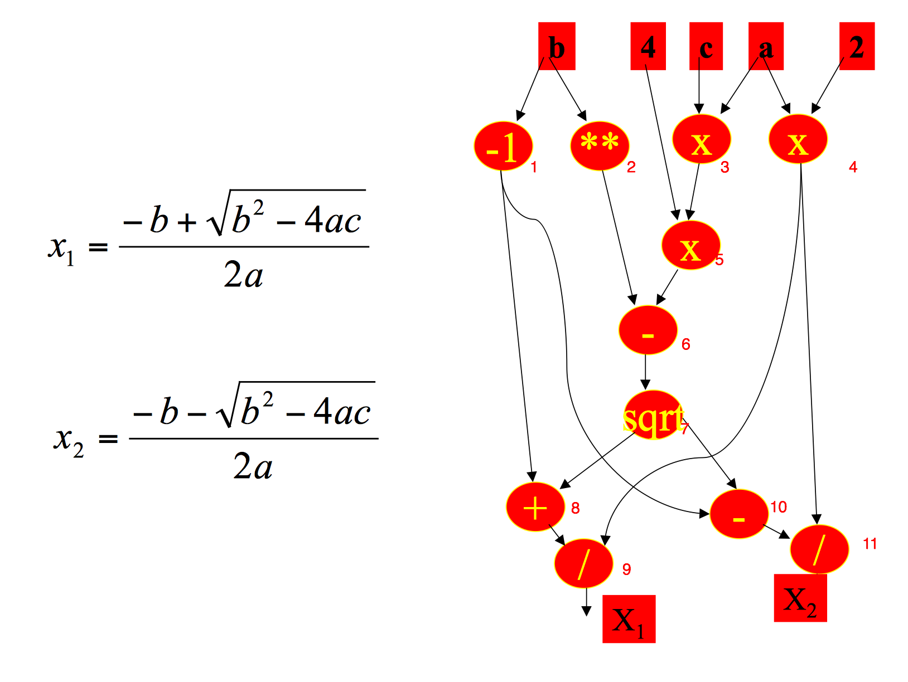

## Sequential

* 5 PUs.
* 4 edges.
* They form a sequence.
* Indegree and outdegree are both 1.
* Each PU gets input, pluses 1 and passes it to output.
* Each PU gets input from previous PU's output.
* It will take 5 time units.

## Matrix Multiplication

* http://www.cs.hmc.edu/courses/2001/spring/cs156/
* 9 PUs
* 12 edges
* They form a matrix.
* Directly copy input to output.
* a is Input(0) and b is Input(1).
* Indegree and outdegree are both 2.
* Multiply two input together and add to PU's local storage.
* It will take 7 time units.
* 5 sources and 1 sink. When sink's output is not NaN for first time, it indicates the termination of multiplication.

## Quadratic formula

* 11 PUs
* 12 edges
* Computing both solution of quadratic formula
* If in sequential way, it will take 22 steps. But using this DFG, it will take 6 steps.

